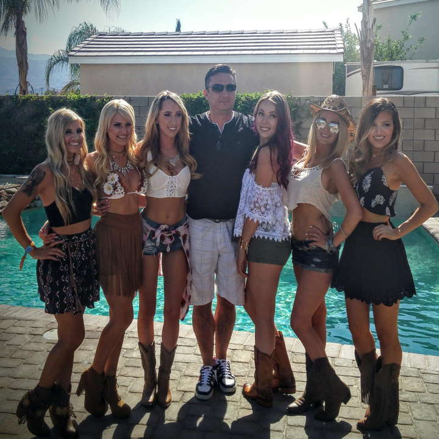
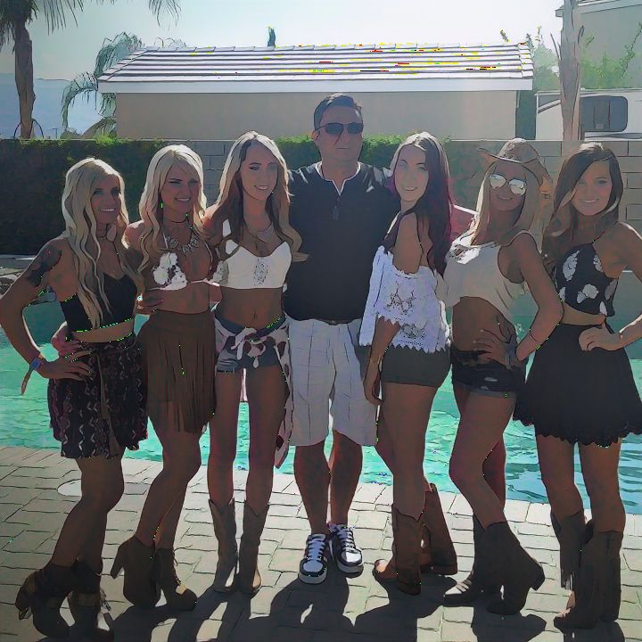

# Anime Cartoonization

**Live Demo: <https://vladmandic.github.io/anime/public/>**

 

## Implementation

Couple of different implementations of processing:
- Using **TFJS** in browser  
  Processing using `@tensorflow/tfjs-backend-webgl`  
  `public/index.html` & `src/anime.ts`  
- Using **WebSockets** to send frame data to **NodeJS** backend for processing and receiving data back  
  Processing using `@tensorflow/tfjs-node-gpu` with **CUDA** acceleration  
  `public/sockets.html` & `src/anime.ts` client-side  
  `src/node.ts` server-side  

 

## Screenshot

 

# Credits

- Orignal: <https://github.com/SystemErrorWang/White-box-Cartoonization>
- Port: <https://github.com/PINTO0309/PINTO_model_zoo/tree/main/019_White-box-Cartoonization>
